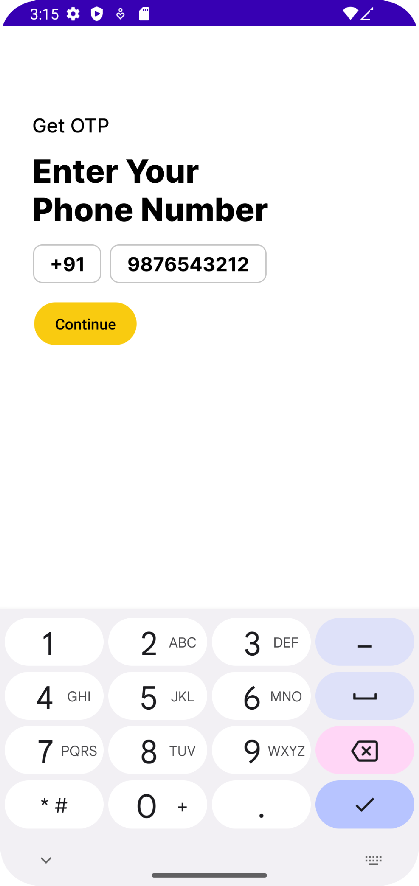
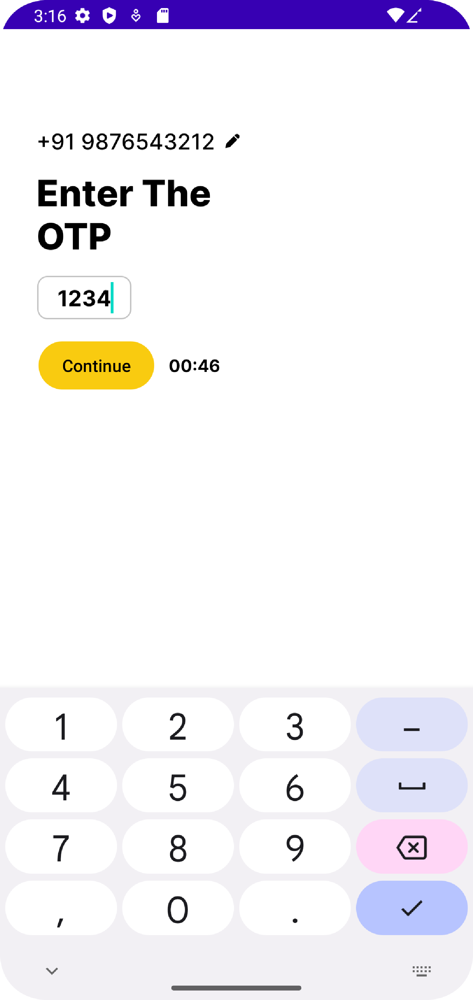

# Project 1
## Answer to likes reset at midnight problem
Store the number of likes and the last accessed time of the user in the database. When the user uses the app the last stored time and current time needs to be 
compared to check if a day has been passed. Its unnecessary to reset all the users' number of likes at 12:00 pm; instead could be only reset when 
the user opens the app because until then the attribute is not used. Similar to lazy initialization.

# Project 2
## Login flow Android app
Sample login flow in Android for Aisle tech challenge
### APK
[Apk file here.](/apk/app-debug.apk)
### Screenshots
 
 
# Result
Not selected in this round. Got a mail saying that other candidates stood out.
